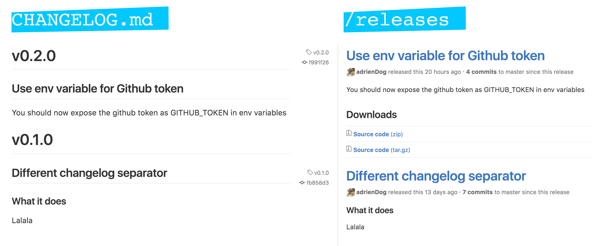

# release-to-github-with-changelog
[](https://circleci.com/gh/adrienDog/release-t--github-with-changelog)

[](https://badge.fury.io/js/release-to-github-with-changelog)

*Node v6.9.1 is required*

## Goal
Keep the released npm package in sync with the GitHub repo master branch:
- the last `CHANGELOG.md` item is in sync with the last release on Github, with corresponding version tag
- the `package.json` version is in sync with the `master` branch version tag



## Usage
The sources of truth are `CHANGELOG.md` and `package.json`.
Your interface is your `CHANGELOG.md`.
### CHANGELOG.md
Every `CHANGELOG.md` item should represent a release note of the version it describes:
```
# v0.2.0 //version tag
## The release title
// The release description in markdown

<!-- -->

```
`<!-- -->` is the separator between your items. It does not appear when Markdown is rendered.
#### Full example:
```
# v0.2.0
## Use env variable for Github token
You should now expose the github token as GITHUB_TOKEN in env variables

<!-- -->

# v0.1.0
## Different changelog separator
### What it does
Lalala

<!-- -->

//...
```
### Export a GITHUB_TOKEN env variable
Either locally with `export GITHUB_TOKEN=$yourToken` or in your CI tool settings (see CircleCI example).

### Example of package.json
Don't forget the `repository.fullname`.
```
{
  "version": "0.2.0",
  "respository": {
    "type": "git",
    "fullname": "myOrg/myRepo",
    "url": "git+https://github.com/myOrg/myRepo.git"
  },
  "files": ["dist"],
  "scripts": {
    "build": // build dist files
    "release": "npm publish && npm run release-to-github-with-changelog",
    "test": // your test command
  }
}
```
## CI example
`circle.yml`
```
machine:
  node:
    version: 4.1.0
dependencies:
  pre:
    - echo -e "$NPM_USER\n$NPM_PASS\n$NPM_EMAIL" | npm login
deployment:
  production:
    branch: master
    commands:
      - npm run release
```
